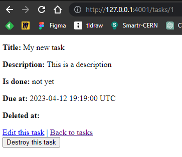

# Ruby On Rails - Todo List


## Introduction

Hope it can help :)

## Summary

- [Requirements](#requirements)
- [Tools and version](#tools-and-versions)
- [Folder structure](#folder-structure)
- [Makefile usage](#makefile-usage)
- [Project : Ruby on Rails Start](#project)
- [Some tips](#tips)

- Useful resources :

- [Sources](#sources)

## Requirements

- NodeJS and npm installed on local machine or development server
- Ruby installed with Gem and Rails

Install Rails with gem:

```sh
#check if exist
gem --version

gem install rails
```

Assuming you have installed Rails using RubyGems, keeping it up-to-date is relatively easy. We can use the same command in both Windows and Linux platform.

```sh
gem update rails
```

## Tools and versions

- OS

  - Kali Linux OS - Ruby v3.1.2
  - Windows OS - Ruby v3.2.2

- IDE

  - VSCodium v1.77.1

- Gem v3.4.10
- Rails v7.0.4.3

## Folder structure

```sh
├── app
|  ├── assets
|  |  ├── builds
|  |  ├── config
|  |  |  └── manifest.js
|  |  ├── images
|  |  └── stylesheets
|  |     ├── application.css
|  |     ├── components
|  |     ├── config
|  |     ├── layouts
|  |     └── mixins
|  ├── controllers
|  |  ├── application_controller.rb
|  |  ├── concerns
|  |  └── tasks_controller.rb
|  ├── helpers
|  |  ├── application_helper.rb
|  |  └── tasks_helper.rb
|  ├── javascript
|  |  ├── application.js
|  |  └── controllers
|  |     ├── application.js
|  |     ├── hello_controller.js
|  |     └── index.js
|  ├── models
|  |  ├── application_record.rb
|  |  ├── concerns
|  |  └── task.rb
|  └── views
|     ├── layouts
|     |  ├── application.html.erb
|     |  ├── mailer.html.erb
|     |  └── mailer.text.erb
|     └── tasks
|        ├── edit.html.erb
|        ├── index.html.erb
|        ├── index.json.jbuilder
|        ├── new.html.erb
|        ├── show.html.erb
|        ├── show.json.jbuilder
|        ├── _form.html.erb
|        ├── _task.html.erb
|        └── _task.json.jbuilder
├── bin
|  ├── bundle
|  ├── bundle.cmd
|  ├── dev
|  ├── importmap
|  ├── rails
|  ├── rake
|  └── setup
├── config
|  ├── application.rb
|  ├── boot.rb
|  ├── cable.yml
|  ├── credentials.yml.enc
|  ├── database.yml
|  ├── environment.rb
|  ├── environments
|  |  ├── development.rb
|  |  ├── production.rb
|  |  └── test.rb
|  ├── importmap.rb
|  ├── initializers
|  |  ├── assets.rb
|  |  ├── content_security_policy.rb
|  |  ├── filter_parameter_logging.rb
|  |  ├── inflections.rb
|  |  └── permissions_policy.rb
|  ├── locales
|  |  └── en.yml
|  ├── master.key
|  ├── puma.rb
|  ├── routes.rb
|  └── storage.yml
├── config.ru
├── db
|  ├── migrate
|  |  └── 20230410165411_create_tasks.rb
|  ├── schema.rb
|  └── seeds.rb
├── Gemfile
├── Gemfile.lock
├── lib
|  ├── assets
|  └── tasks
├── log
|  └── development.log
├── Procfile.dev
├── Rakefile
├── README.md
├── storage
├── test
|  ├── application_system_test_case.rb
|  ├── channels
|  |  └── application_cable
|  |     └── connection_test.rb
|  ├── controllers
|  |  └── tasks_controller_test.rb
|  ├── fixtures
|  |  ├── files
|  |  └── tasks.yml
|  ├── helpers
|  ├── integration
|  ├── mailers
|  ├── models
|  |  └── task_test.rb
|  ├── system
|  |  └── tasks_test.rb
|  └── test_helper.rb
├── tmp
|  ├── cache
|  |  ├── assets
|  |  |  └── sprockets
|  |  └── bootsnap
|  |     ├── compile-cache-iseq
|  |     ├── compile-cache-yaml
|  |     └── load-path-cache
|  ├── development_secret.txt
|  ├── pids
|  ├── restart.txt
|  ├── sockets
|  └── storage
└── vendor
|  └── javascript

```

## Makefile Usage

## Project

### Todo list

- Create a new project with given database:

```sh
rails new ruby_test_04-ROR-todo --database=postgresql
```

- Install "pg" package

```rb
gem install pg
```

- Read `.env` file, add in Gemfile

```rb
# Get dotenv to use .env file
gem 'dotenv-rails', groups: [:development, :test]
```

And launch bundle to require the package

```sh
bundle
```

Now you can add .env file in root, don't forget to add it in .gitignore file

```yml
# Test create a database on container on raspberry
development:
adapter: postgresql
encoding: unicode
database: ruby_db
username: <%= ENV["PG_USER"] %>
password: <%= ENV["PG_PASSWORD"] %>
port: <%= ENV["PG_PORT_RASPBERRY"] %>
host: <%= ENV["PG_RASPBERRY_HOST"] %>

# Test create a database on host
test:
adapter: postgresql
encoding: unicode
database: ruby_todo_test
username: <%= ENV["PG_USER"] %>
password: <%= ENV["PG_PASSWORD"] %>
port: <%= ENV["PG_PORT_LOCAL"] %>
host: localhost

production:
adapter: postgresql
encoding: unicode
database: ruby_todo_production
username: <%= ENV["PG_USER"] %>
password: <%= ENV["PG_PASSWORD"] %>
port: <%= ENV["PG_PORT_RASPBERRY"] %>
host: <%= ENV["PG_RASPBERRY_HOST"] %>
```

In .env file:

```PG_RASPBERRY_HOST=
PG_PASSWORD=
PG_DATABASE=
PG_USER=
PG_PORT_LOCAL=
PG_PORT_RASPBERRY=
```

- Create database with rails (once database is configured)

```sh
rails db:create
```

I've tested 2 configurations options : first connect to my local machine port 5233 and another instance of PostgreSQL in a Docker container in my RaspberryPi server

Results:


- Scaffold in Ruby

Scaffolding in Ruby on Rails refers to the auto-generation of a set of a model, views and a controller usually used for a single database table.

This will generate a table model with attributes, a corresponding database migration, a controller with full CRUD actions, and views for each action (index, show, new, edit).

This can save a lot of time and effort in creating a basic CRUD interface for a database table. However, it's important to keep in mind that scaffolding should be used as a starting point and customized as needed to fit the specific requirements of the project.

You can auto-generate a ready to use controller, model, and views with a full CRUD (Create, Read, Update, Delete) web interface for the Story table using the following command:

```sh
rails g scaffold task title description:text is_done:boolean due_at:datetime deleted_at:datetime
```


- Migration

Migration is to create the table in your database:

You can add default value by changing it into your file in db/migrate

```rb
class CreateTasks < ActiveRecord::Migration[7.0]
  def change
    create_table :tasks do |t|
      t.string :title
      t.text :description
      t.boolean :is_done, default: false
      t.datetime :due_at
      t.datetime :deleted_at

      t.timestamps
    end
  end
end
```

Then migrate:

```sh
rails db:migrate
```


- Launch the server

```sh
rails server
```

And see the result:


## Tips

- Use environment variable in database.yaml file

```yml
host: <%= ENV["PG_RASPBERRY_HOST"] %>
```

- You can specify another port to listen on in .env file

Ensure that you have dotenv-rails package configured

- comment .erb file

```erb
<div>
    <%#= form.label :due_at, style: "display: block" %>
    <%#= form.datetime_field :due_at %>
</div>
```

- Default values in models

```rb
class Task < ApplicationRecord

  # what you want to display when the value changes
  enum is_done: {
         "not yet": false,
         done: true,
       }
end
```

Result:



- An instance variable let you use it into views

```erb
<p style="color: green"><%= notice %></p>

<h1>Tasks</h1>

<div id="tasks">
<%# instance variable is here %>
  <% @tasks.each do |task| %>
    <%= render task %>
    <p>
      <%= link_to "Show this task", task %>
    </p>
  <% end %>
</div>

<%= link_to "New task", new_task_path %>
```

## Useful resources

---

## Sources

- [build rails app](https://www.digitalocean.com/community/tutorials/how-to-build-a-ruby-on-rails-application-on-ubuntu-22-04)
- [tutorial points](https://www.tutorialspoint.com/ruby-on-rails/rails-installation.htm)
- [scaffolding](https://hackernoon.com/ruby-on-rails-command-line-rails-scaffolding-tutorial-8312j3yhu)
